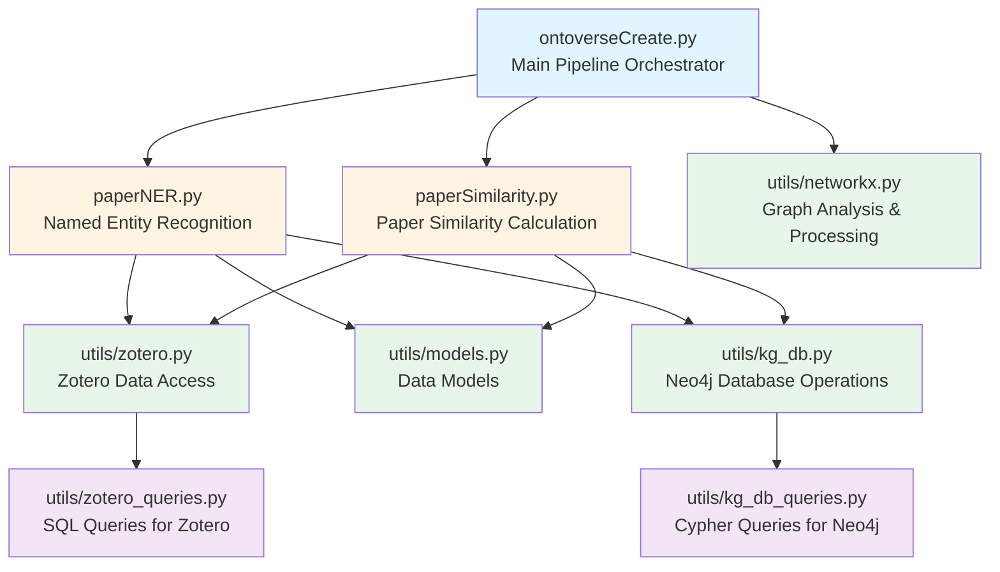
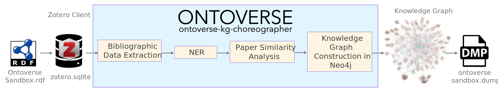

[](https://arxiv.org/abs/2408.03339)

[](#)


**Ontoverse** is a knowledge management platform designed to visualize and explore scientific literature in an intuitive, cartographic manner. The system transforms bibliographic collections into interactive network visualizations where papers are connected based on conceptual similarity and topic occupancy, enabling researchers to discover relationships, identify research trends, and navigate related work within their domain.
The Ontoverse consists of the ontoverse-kg-choreographer, a knowledge graph generation pipeline which transforms bibliographic data into a rich, queryable knowledge graph architecture, and the ontoverse-app which enables the cartographic visualization. 

## Description

The purpose of Ontoverse is:

- **Visual Literature Exploration**: Transform large collections of scientific papers into navigable knowledge graphs where conceptual relationships are visually apparent
- **Concept-Based Discovery**: Connect papers through shared biomedical concepts (entities like diseases, genes, proteins, drugs) rather than simple keyword matching
- **Research Landscape Mapping**: Reveal the structure and topology of research domains, showing how different topics and papers relate to one another
- **Enhanced Literature Review**: Enable researchers to quickly identify related work, find papers on similar topics, and understand the conceptual landscape of their field

## Knowledge Graph Generation Pipeline
 
The **Ontoverse knowledge graph generation pipeline** transforms bibliographic data into a rich, queryable knowledge graph stored in Neo4j. A novel method allows for multi-topic occupancy whereby individual papers can appear in more than one location in the map so that we can visualise connections between topics and the contribution of papers across multiple domains. Here's what the pipeline does:
 
#### 1. **Bibliographic Data Extraction**
- Reads the RDF bibliography (exported from Zotero)
- Extracts metadata: titles, authors, dates, abstracts, URLs, journal/conference information
- Organizes papers into hierarchical topic collections
 
#### 2. **Biomedical Named Entity Recognition (NER)**
- **Processes:** Paper titles and abstracts
- **Extracts:** Biomedical concepts using multiple specialized NLP models:
  - `en_ner_craft_md` - CRAFT corpus entities
  - `en_ner_jnlpba_md` - Gene/protein entities
  - `en_ner_bc5cdr_md` - Chemical/disease entities
  - `en_ner_bionlp13cg_md` - Biomedical events
  - `en_core_sci_scibert` - General scientific entities
- **Links entities to UMLS:** Maps recognized entities to Concept Unique Identifiers (CUIs) from the Unified Medical Language System
- **Creates mappings:** Links CUIs to standard vocabularies (MeSH, HPO, HGNC, NCI, RxNorm)
 
#### 3. **Paper Similarity Analysis**
- **Calculates similarity:** Compares papers based on shared biomedical concepts (CUI overlap)
- **Creates relationships:** Connects papers with similar content
- **Two types of connections:**
  - **Within-topic relationships:** Papers in the same hierarchical topic
  - **Between-topic relationships:** Papers across different topics with shared concepts
- **Configurable threshold:** Minimum number of shared concepts required for similarity (default: 6)
 
#### 4. **Knowledge Graph Construction in Neo4j**
The pipeline populates a Neo4j graph database with:
 
**Node Types:**
- **Paper nodes:** Individual research articles with full metadata
- **PaperClone nodes:** Virtual instances representing papers that appear in multiple topics (multi-topic occupancy)
- **Collection nodes:** Hierarchical topic/theme collections
 
**Relationship Types:**
- **PARENT_OF:** Hierarchical topic relationships (Collection → Collection)
- **MEMBER_OF:** Paper belongs to topic (Paper → Collection)
- **SIMILAR_TO:** Papers with shared biomedical concepts
- **MATCHING:** Links Paper nodes to their PaperClone instances
 
**Graph Properties:**
- Papers annotated with extracted biomedical entities (CUIs)
- Topics annotated with hierarchy level and occupancy statistics
- Similarity scores based on concept overlap
- Full bibliographic attributes for querying and filtering
 
#### 5. **Result: A Queryable Knowledge Graph**

### How Paper Similarity is Captured

Ontoverse employs a sophisticated multi-stage pipeline to calculate paper similarity based on shared biomedical concepts:

#### 1. **Named Entity Recognition (NER)**
The system uses multiple state-of-the-art biomedical NLP models to extract named entities from paper abstracts:
- `en_ner_craft_md` - CRAFT corpus entities
- `en_ner_jnlpba_md` - JNLPBA entities
- `en_ner_bc5cdr_md` - Chemicals and diseases
- `en_ner_bionlp13cg_md` - Cancer genetics entities  
- `en_core_sci_scibert` - General scientific entities

#### 2. **Entity Linking to UMLS**
Extracted entities are linked to Concept Unique Identifiers (CUIs) from the Unified Medical Language System (UMLS), providing standardized biomedical concept representations. This ensures that different mentions of the same concept (e.g., "breast cancer" vs "mammary carcinoma") are recognized as identical.

#### 3. **Pairwise Similarity Calculation**
Paper similarity is computed by:
- Comparing all paper pairs in the collection
- Counting the number of shared CUIs between each pair
- A similarity score is the **count of overlapping concepts** between two papers
- For example, if Paper A and Paper B share 8 common CUIs, their similarity score is 8

#### 4. **Similarity Thresholding**
The `similar_paper_cutoff` parameter defines the minimum number of shared concepts required to create a similarity relationship:
- Higher cutoff values (e.g., 10) create sparser graphs with only highly similar papers connected
- Lower cutoff values (e.g., 3-5) create denser graphs capturing weaker conceptual relationships
- The optimal threshold depends on your dataset size and domain specificity

#### 5. **Knowledge Graph Construction**
Papers and their relationships are exported to a Neo4j graph database where:
- **Nodes** represent papers and biomedical concepts (topics)
- **Edges** represent similarity relationships, both:
  - *Within-topic edges*: Papers sharing the same research topic
  - *Between-topic edges*: Papers bridging different topics

This approach enables concept-based similarity that goes beyond simple keyword matching, capturing deeper semantic relationships between papers 

## Library Architecture

The Ontoverse library is organized into modular components that handle different stages of the knowledge graph creation pipeline:



**Key Components:**

- **ontoverseCreate.py**: Main orchestration pipeline that coordinates the entire workflow from Zotero ingestion through Neo4j population
- **paperNER.py**: `OntoverseNERPipeline` class that performs Named Entity Recognition using multiple biomedical NLP models and links entities to UMLS CUIs
- **paperSimilarity.py**: `PaperSimilarityPipeline` class that calculates pairwise paper similarity based on shared concepts and creates graph edges
- **utils/zotero.py**: Functions for connecting to and extracting data from Zotero SQLite database
- **utils/models.py**: Data models (e.g., `BibliographicObject`) representing papers, authors, and metadata
- **utils/kg_db.py**: Neo4j database connection, node/relationship creation, and graph population operations
- **utils/networkx.py**: NetworkX-based graph analysis for topic hierarchies and occupancy calculations
- **utils/zotero_queries.py**: SQL query templates for extracting papers, collections, and tags from Zotero
- **utils/kg_db_queries.py**: Cypher query templates for creating and updating Neo4j graph structures

## Quick start instructions
use the **uv** package and install the local package.
```
pip install uv
uv sync
source .venv/bin/activate
uv pip install .
```

use the **uv** package and install the local package.
```
pip install uv
uv sync
source .venv/bin/activate
uv pip install .
```


## Project Workflow
1. Read bibliography from Zotero
2. Create graph in python using UMLS vocabulary to define topics
3. Export graph into a neo4j database

Note: Options for creating neo4j dump files
1. Read bibliography from Zotero
2. Create graph in python using UMLS vocabulary to define topics
3. Export graph into a neo4j database

Note: Options for creating neo4j dump files

### Folders
- pipeline_data/ - files created during the data parsing and graph creation process
- umls_data/ - all files derived from NIH UMLS data used in the annotation and meta-data mapping processes

### Files
- 'zotero.sqlite' file is the Zotero database when this is updated re-run the scripts to create a new graph
- 'umls_parse_notes.md' explains the parsing/formatting process for NIH UMLS data

### Using the new ontoverse package
Set environment variables (for example in a project-root `.env` file, loaded automatically by the pipeline):

- **NEO4J_PASSWORD** — Neo4j user password  
- **NEO4J_DB** — Target Neo4j database name (must already exist on the server; not read from YAML)  
- **ZOTERO_SQLITE_PATH** — Path to `zotero.sqlite` (typically `/Users/<user>/Zotero/zotero.sqlite` on macOS/Linux)

The YAML config file supplies pipeline parameters only (Zotero library name, artifact paths, similarity cutoff, optional `NEO4J_PURGE`). Do not put `NEO4J_DB` in YAML; the program will reject it.

## Generate ontoverse by running script
```
neo4j start # start your database manually or with commandline

python src/kgs_rnd_ontoverse/ontoverseCreate.py -c config/params_ontoverse.yaml
``` 

## To run alternative ontoverses 
1. On your own dataset you must have a separate library in zotero
2. Set **NEO4J_DB** (and other env vars above) in `.env` or your shell for the Neo4j database you want to use.
3. Generate a new yaml config file in the **config** directory with at least:
    * **zotero_library_name**: exact name of the Zotero collection or group library  
    * **pipeline_artifact_location**: directory for cached pipeline artifacts  
    * **similar_paper_cutoff**: minimum shared concepts to link papers (lower → denser graph)  
    * **NEO4J_PURGE** (optional): `"True"` or `"False"`; defaults to `"True"` if omitted (empty DB before load)
4. Run `python src/kgs_rnd_ontoverse/ontoverseCreate.py -c config/<your-config>.yaml`  

## Example: Ontoverse Sandbox Literature Collection



This example walks through creating a new Ontoverse knowledge graph from a custom Zotero collection called "OntoverseSandbox".

### Step 1: Set up Zotero Collection

**Prerequisites**:
- Install Zotero desktop application from [https://www.zotero.org/download/](https://www.zotero.org/download/)
- Download the example RDF library from [zotero_library/OntoverseSandbox.rdf](zotero_library/OntoverseSandbox.rdf) to your local machine

1. **Import the example RDF library**:
   - Open Zotero desktop application
   - Go to File → Import...
   - Select the downloaded `OntoverseSandbox.rdf` file
   - Choose to import into a new collection
   - This will create an `OntoverseSandbox` collection with example papers

2. **Note the Zotero database location**:
   - Typically located at `/Users/<username>/Zotero/zotero.sqlite` on macOS/Linux
   - Set the environment variable: `export ZOTERO_SQLITE_PATH="/Users/<username>/Zotero/zotero.sqlite"`

### Step 2: Create Configuration File

Create a new YAML configuration file (for example `config/params_sandbox.yaml`):

```yaml
zotero_library_name: "OntoverseSandbox"
pipeline_artifact_location: "pipeline_data/pipeline_artifacts/sandbox"
similar_paper_cutoff: 5
NEO4J_PURGE: "True"
```

**Configuration parameters (YAML)**:
- `zotero_library_name`: Must match the **exact name** of your Zotero collection  
- `pipeline_artifact_location`: Directory for intermediate/cache files  
- `similar_paper_cutoff`: Minimum shared concepts to link papers (3–5 for small collections, 6–10 for larger ones)  
- `NEO4J_PURGE`: `"True"` to clear the target Neo4j database at startup, `"False"` to keep existing data  

**Environment (`.env` or exports), not YAML**:
- `NEO4J_DB`: Neo4j database name (create the database in Neo4j first, e.g. `ontoversesandbox`; use letters, digits, underscores)  
- `NEO4J_PASSWORD`, `ZOTERO_SQLITE_PATH`: as in the “Using the new ontoverse package” section above

### Step 3: Generate the Neo4j Database

Ensure Neo4j is running and environment variables are set:

```bash
# Start Neo4j database
neo4j start

# Ensure required environment variables are set
export NEO4J_PASSWORD="your_neo4j_password"
export NEO4J_DB="ontoversesandbox"
export ZOTERO_SQLITE_PATH="/Users/<username>/Zotero/zotero.sqlite"

# Generate the Ontoverse knowledge graph
python src/kgs_rnd_ontoverse/ontoverseCreate.py -c config/params_sandbox.yaml
```

The pipeline will:
1. Extract papers and abstracts from Zotero
2. Perform NER to identify biomedical concepts
3. Calculate pairwise paper similarity
4. Populate the Neo4j database named in `NEO4J_DB` (e.g. `ontoversesandbox`)

### Step 4: Create Neo4j Dump for Production

Once the database is successfully created, generate a dump file for deployment:

```bash
# Stop Neo4j to ensure clean dump
neo4j stop

# Create dump file in the backups directory
neo4j-admin database dump --verbose ontoversesandbox --to-path=backups

# This creates: backups/ontoversesandbox.dump
```

The dump file can now be uploaded to development or production environments using:

```bash
python scripts/upload_dump.py -d backups/ontoversesandbox.dump -n ontoversesandbox -e dev
```

Or for production deployment:

```bash
python scripts/upload_dump.py -d backups/ontoversesandbox.dump -n ontoversesandbox -e prod
```

### Troubleshooting Tips

- **Collection name mismatch**: Ensure `zotero_library_name` in config exactly matches the Zotero collection name (case-sensitive)
- **No similarity relationships**: If papers aren't connecting, try lowering `similar_paper_cutoff` to 3 or 4
- **Missing abstracts**: Papers without abstracts will have limited concept extraction; ensure your Zotero entries include abstract data
- **Database already exists**: Drop the database matching your `NEO4J_DB` (e.g. `neo4j-admin database drop ontoversesandbox`) before regenerating if you need a clean slate

## License

This project is licensed under the Apache License 2.0 - see the [LICENSE](LICENSE) file for details.

## Contributing

Please read [CONTRIBUTING.md](CONTRIBUTING.md) for details on our code of conduct and the process for submitting pull requests.

## Authors

See [AUTHORS.md](AUTHORS.md) for the list of authors and maintainers.

## Citation

If you use the Ontoverse, please cite

**The Ontoverse: Democratising Access to Knowledge Graph-based Data Through a Cartographic Interface**  
Johannes Zimmermann, Dariusz Wiktorek, Thomas Meusburger, Miquel Monge-Dalmau, Antonio Fabregat, Alexander Jarasch, Günter Schmidt, Jorge S. Reis-Filho, T. Ian Simpson  
*arXiv preprint arXiv:2408.03339* (2024)  
[[arXiv]](https://arxiv.org/abs/2408.03339) [[PDF]](https://arxiv.org/pdf/2408.03339)
